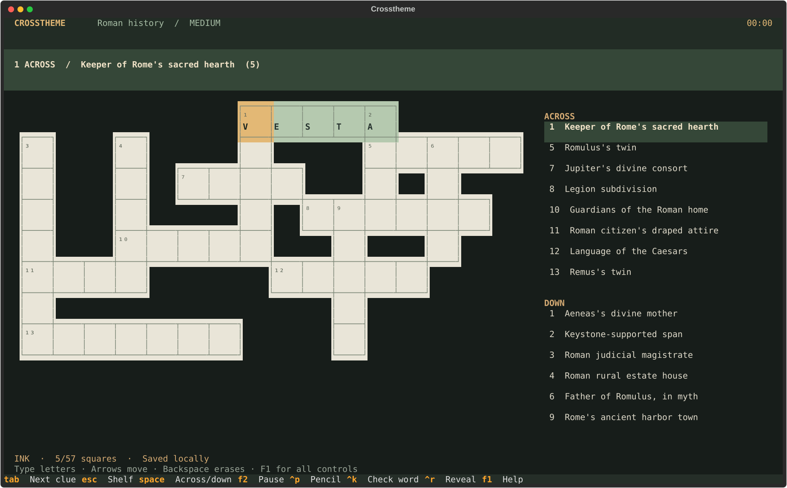

# Crosstheme

**Follow your curiosity. Fill in the squares.**

A theme-first crossword studio for your terminal. Pick a subject, choose a difficulty,
and turn what you know into a puzzle. Generate with your signed-in Claude or Codex CLI,
or start offline with software engineering and Roman history.



## Run

Requires Python 3.11+ and [uv](https://docs.astral.sh/uv/getting-started/installation/).
Clone the repository and run from its directory:

```sh
git clone https://github.com/ztaylor/crosstheme.git
cd crosstheme
uv sync --locked
uv run crosstheme
```

For a command available anywhere in your terminal:

```sh
uv tool install .
crosstheme
```

No API key is needed when your CLI is already signed in with your subscription.
Run `claude` or `codex login` once if necessary. Generation uses the selected CLI's
existing authentication, model configuration, and usage limits; it requires connectivity.
Saved puzzles and the two offline themes work without a model or network.

```sh
crosstheme doctor
crosstheme new "Roman history" --provider claude --difficulty medium
crosstheme new "Software engineering" --provider codex --difficulty hard --size long
crosstheme new "Software engineering" --provider offline --size quick
```

The shelf lets you create, filter, resume, and revisit puzzles. The two starter buttons
appear in an empty library. Press **N** or select **New puzzle** for another subject.

## A puzzle that fits your mood

| Choice | What it changes |
| --- | --- |
| Easy | Direct clues, familiar vocabulary; Monday-like cluing |
| Medium | Less direct clues, moderate topic knowledge, light misdirection |
| Hard | Subtle definitions, fair wordplay, deeper topic knowledge |
| Quick | 8 clues, at most 13 × 13 |
| Standard | 14 clues, at most 17 × 17 |
| Long | 20 clues, at most 21 × 21 |

All entries belong to the subject or its natural neighborhood. Grids are connected,
numbered in reading order, and checked for conflicting crossings, overlapping entries,
and accidental unclued words. Difficulty and length are independent.

These are **theme-first freeform crosswords**. They do not require rotational symmetry
or two answers through every letter. This gives the constructor room to keep *every*
answer relevant. Strict newspaper grids, rebuses, and cryptic crosswords are outside v1.

Clues are original and use American/NYT-style conventions: matching grammar, signaled
abbreviations and foreign words, blanks, and question marks for wordplay. Model-generated
clues are not professionally edited; factual accuracy, thematic fit, and subjective difficulty
can vary. Structural grid validity is checked in code. The app is not affiliated with the NYT.

## Make yourself at home

| Key | Action |
| --- | --- |
| A–Z | Enter a letter and advance within the answer |
| Arrow keys | Move; change direction first at a crossing |
| Space | Switch across/down |
| Tab / Shift+Tab | Next / previous clue |
| Backspace | Erase; move backward when the square is already empty |
| Delete | Erase the current square |
| Ctrl+P | Toggle pencil mode |
| Ctrl+K | Check the current word; errors are marked red |
| Ctrl+R | Reveal the current letter after confirmation |
| F2 | Pause/resume; hides clues and grid while paused |
| F1 | Help; after solving, also shows the current clue's explanation when available |
| Esc | Save and return to the shelf |
| Ctrl+Q | Save and quit |
| Mouse | Select a square or clue; click the selected crossing to switch direction |

All letters, including Q and H, are available for answers. Filled clues dim without revealing
whether they are correct. Revealed letters are purple and locked. Checks and reveals mark a
solve as assisted. The puzzle recognizes a correct finish automatically and freezes its timer.
Completed puzzles remain available to browse, with their original time and assistance record.

Time counts active play across sessions. It pauses on the shelf, in help/reveal dialogs,
and when you press F2. Letters and cursor changes save immediately; the timer checkpoints
every second. An abrupt process kill can lose up to the last timer checkpoint, but letters
already saved remain intact. Use explicit pause when stepping away from an open terminal.

The board uses continuous borders, blank empty squares, small corner numbers, and centered
letters. It adapts to 80 × 24 with compact numbered cells, scrolling, and the active clue
always above the grid. A larger terminal gives you roomier squares and side-by-side clues;
the layout reserves enough width for the board before placing clues beside it.
Standard terminal fonts work; Nerd Font icons are not required. `NO_COLOR` is respected.

## Your library belongs to you

On Linux and macOS, the default database is:

```text
~/.local/share/crosstheme/puzzles.sqlite3
```

`XDG_DATA_HOME` changes the base directory. `CROSSTHEME_DATA_DIR` or `--data-dir`
sets a specific library directory. Quit the app before copying the database for backup.
Use one solving app per library to avoid two sessions overwriting the same puzzle's progress.

```sh
crosstheme list
crosstheme play <id-or-unique-prefix>
crosstheme export <id-or-unique-prefix> --output puzzle.json
crosstheme --data-dir ./my-library new "Jazz harmony" --provider claude --no-play
```

Exports include the **solution**, clues, explanations, construction seed, and metadata, but not
personal solve progress. Export refuses to overwrite an existing file. Exported JSON uses a
versioned format readable by the engine. An interactive import UI is outside v1.

The local adapters use documented noninteractive entry points:
[Codex structured output](https://learn.chatgpt.com/docs/non-interactive-mode) and
[Claude programmatic usage](https://code.claude.com/docs/en/headless).
Prompts run in a temporary working directory. Claude is called with tools disabled and an empty
MCP configuration; Codex is called with a read-only sandbox. Crosstheme does not extract tokens
or make direct API calls. Model output is treated as data, never as executable code.

A generation has a four-minute provider timeout. Cancel with Esc; cancellation terminates
the CLI process group, and incomplete puzzles never enter the shelf. Missing logins,
usage-limit errors, malformed content, and insufficient usable answers are shown as errors.
There is no silent switch to a different topic or provider. `auto` chooses Claude, then Codex,
then offline based on availability on PATH. `--model` optionally overrides the CLI model.

## Engine, ready for another screen

The engine and session logic have only standard-library dependencies:

```python
from crosstheme.engine import Progress, construct
from crosstheme.seeds import starter_candidates
from crosstheme.session import Session

_, candidates = starter_candidates("Roman history", "medium")
puzzle = construct(candidates, topic="Roman history", size="quick", seed=42)
session = Session(puzzle, Progress())
session.type_letter("A")
portable_puzzle = puzzle.to_dict()
```

- `engine.py`: immutable puzzles, grid construction/validation, solve state, JSON contract.
- `session.py`: movement, editing, active-time accounting, completion.
- `providers.py`: async Claude/Codex adapters, constrained content parsing, offline generation.
- `storage.py`: versioned SQLite storage with transactional saves.
- `app.py` / `app.tcss`: Textual screens, rendering, and interaction.
- `cli.py`: commands and launch wiring.

A web or mobile client can use the same engine through a Python service and versioned JSON.
Such a service should keep solutions server-side while sending players clues and geometry.
There is no web server or mobile client bundled with v1.

## Develop and verify

```sh
uv sync --locked
uv run ruff check src tests
uv run ruff format --check src tests
uv run pytest -q
uv build
```

Tests cover all theme/difficulty/length combinations, seeded generation, independent grid
invariants, save/reopen, clocks and completion, subprocess contracts, malformed content,
timeouts/cancellation, and headless terminal interactions at desktop and compact sizes.
See [development notes](docs/BUILD.md) and [project instructions](AGENTS.md).
